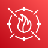
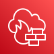
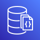
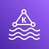
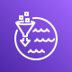

# ☁️ AWS ↔ Azure Services Mapping Reference

  

> Note: the icon columns below assume you have extracted the official AWS and Azure SVG icon packs locally into `./assets/aws/` and `./assets/azure/`.
> The official download pages are listed at the end.

## Table of Contents

- [☁️ AWS ↔ Azure Services Mapping Reference](#️-aws--azure-services-mapping-reference)
  - [Table of Contents](#table-of-contents)
  - [🖥️ Compute \& Serverless](#️-compute--serverless)
  - [📦 Containers \& App Platform](#-containers--app-platform)
  - [💾 Storage, Transfer \& Backup](#-storage-transfer--backup)
  - [🌐 Networking, Delivery \& Edge](#-networking-delivery--edge)
  - [🔐 Security, Identity \& Governance](#-security-identity--governance)
  - [🗄️ Databases \& Caching](#️-databases--caching)
  - [📊 Analytics, Streaming \& Data](#-analytics-streaming--data)
  - [🤖 AI, ML \& Search](#-ai-ml--search)
  - [📩 Messaging, Integration \& Automation](#-messaging-integration--automation)
  - [📈 Observability, DevOps \& Migration](#-observability-devops--migration)
  - [📚 Official Documentation Links](#-official-documentation-links)
    - [AWS](#aws)
    - [Azure](#azure)
  - [Notes](#notes)

## 🖥️ Compute & Serverless

| AWS | Azure | Description |
|---|---|---|
|  **EC2** |  **Virtual Machines** | Virtual servers / cloud compute instances |
|  **EC2 Auto Scaling** |  **VM Scale Sets** | Automatic scaling of compute capacity |
|  **Lambda** |  **Azure Functions** | Serverless event-driven compute |
|  **Elastic Beanstalk** |  **App Service** | Managed application deployment platform |
|  **Lightsail** |  **App Service Plans** | Simplified VPS-style hosting |
|  **Batch** |  **Azure Batch** | Batch processing jobs |
|  **Spot Instances** |  **Spot Virtual Machines** | Discounted interruptible compute |
|  **Image Builder** |  **Azure Image Builder** | Golden image build automation |
|  **App Runner** |  **Container Apps** | Managed app deployment for containers |
|  **Outposts** |  **Azure Stack Hub** | Hybrid cloud infrastructure |
|  **Local Zones** |  **Edge Zones** | Low-latency local compute |
|  **Wavelength** |  **Edge Zones** | Ultra-low-latency edge compute |
|  **VMware Cloud on AWS** |  **Azure VMware Solution** | Managed VMware platform |
|  **WorkSpaces** |  **Azure Virtual Desktop** | Managed virtual desktops |

[⬆ Back to top](#-aws--azure-services-mapping-reference)

## 📦 Containers & App Platform

| AWS | Azure | Description |
|---|---|---|
|  **ECS** |  **Container Apps** | Managed container orchestration |
|  **EKS** |  **AKS** | Managed Kubernetes |
|  **Fargate** |  **Container Apps Jobs** | Serverless containers |
|  **ECR** |  **Container Registry** | Container image registry |
|  **ECS Anywhere** |  **Azure Arc-enabled Kubernetes** | Run containers outside the cloud |
|  **EKS Anywhere** |  **Azure Arc-enabled Kubernetes** | Kubernetes anywhere management |
|  **AWS Proton** |  **Deployment Environments** | Template-based app delivery |
|  **App Mesh** |  **Service Mesh** | Service-to-service networking |
|  **Cloud Map** |  **Private DNS** | Service discovery and naming |
|  **Elastic Container Service Anywhere** |  **Azure Arc-enabled Kubernetes** | Hybrid container management |
|  **Lightsail Containers** |  **Container Instances** | Simplified container hosting |
|  **Serverless Application Repository** |  **Azure Marketplace** | Reusable serverless app patterns |
|  **CodeCatalyst** |  **Dev Center** | Integrated app delivery workspace |
|  **Elastic Beanstalk Extensions** |  **App Service** | Platform configuration and deployment |

[⬆ Back to top](#-aws--azure-services-mapping-reference)

## 💾 Storage, Transfer & Backup

| AWS | Azure | Description |
|---|---|---|
|  **S3** |  **Blob Storage** | Object storage |
|  **EBS** |  **Managed Disks** | Block storage for VMs |
|  **EFS** |  **Azure Files** | Managed shared file storage |
|  **FSx** |  **Azure NetApp Files** | Enterprise file systems |
|  **S3 Glacier** |  **Archive Storage** | Long-term archival storage |
|  **Storage Gateway** |  **File Sync** | Hybrid storage gateway |
|  **DataSync** |  **Azure Data Factory** | Data movement and synchronization |
|  **Snowball** |  **Data Box** | Offline data migration |
|  **AWS Backup** |  **Azure Backup** | Centralized backup |
|  **Elastic Disaster Recovery** |  **Site Recovery** | Disaster recovery orchestration |
|  **Transfer Family** |  **Storage Mover** | Managed file transfers |
|  **S3 Replication** |  **Blob Redundancy** | Cross-region data replication |
|  **Backup Audit Manager** |  **Policy** | Backup compliance checks |
|  **FSx for Lustre** |  **Azure HPC Cache** | High-performance file storage |

[⬆ Back to top](#-aws--azure-services-mapping-reference)

## 🌐 Networking, Delivery & Edge

| AWS | Azure | Description |
|---|---|---|
|  **Route 53** |  **Azure DNS** | Managed DNS |
|  **Elastic Load Balancer** |  **Load Balancer** | Traffic distribution |
|  **CloudFront** |  **Azure CDN** | Content delivery network |
|  **API Gateway** |  **API Management** | API publishing and security |
|  **Direct Connect** |  **ExpressRoute** | Dedicated private connectivity |
|  **VPN** |  **VPN Gateway** | Secure site-to-site connectivity |
|  **Transit Gateway** |  **Virtual WAN** | Network hub architecture |
|  **PrivateLink** |  **Private Link** | Private service access |
|  **Global Accelerator** |  **Front Door** | Global traffic optimization |
|  **WAF** |  **Web Application Firewall** | Web traffic protection |
|  **Cloud WAN** |  **Virtual WAN** | Global network management |
|  **Network Firewall** |  **Azure Firewall** | Managed network firewall |
|  **VPC Lattice** |  **Application Gateway** | Service-to-service connectivity |
|  **Route 53 Resolver** |  **DNS Private Resolver** | Hybrid DNS resolution |

[⬆ Back to top](#-aws--azure-services-mapping-reference)

## 🔐 Security, Identity & Governance

| AWS | Azure | Description |
|---|---|---|
|  **IAM** |  **Entra ID** | Identity and access management |
|  **IAM Identity Center** |  **Entra ID** | Single sign-on and access control |
|  **KMS** |  **Key Vault** | Key and secret management |
|  **Secrets Manager** |  **Key Vault Secrets** | Secret storage |
|  **Certificate Manager** |  **Key Vault Certificates** | Certificate lifecycle management |
|  **GuardDuty** |  **Defender for Cloud** | Threat detection |
|  **Inspector** |  **Defender for Cloud** | Security posture and vulnerability scanning |
|  **Shield** |  **DDoS Protection** | DDoS protection |
|  **Macie** |  **Purview** | Sensitive data discovery |
|  **Security Hub** |  **Sentinel** | Central security posture |
|  **Detective** |  **Sentinel** | Security investigation |
|  **Cognito** |  **Entra External ID** | Customer identity and sign-in |
|  **Verified Permissions** |  **API Management** | Fine-grained authorization |
|  **Directory Service** |  **Domain Services** | Managed directory services |

[⬆ Back to top](#-aws--azure-services-mapping-reference)

## 🗄️ Databases & Caching

| AWS | Azure | Description |
|---|---|---|
|  **RDS** |  **Azure SQL Database** | Managed relational database |
|  **Aurora** |  **Azure SQL Hyperscale** | High-performance relational database |
|  **DynamoDB** |  **Cosmos DB** | NoSQL distributed database |
|  **Redshift** |  **Synapse Analytics** | Data warehouse |
|  **Neptune** |  **Cosmos DB Gremlin** | Graph database |
|  **DocumentDB** |  **Cosmos DB Mongo** | Document database |
|  **ElastiCache** |  **Azure Cache for Redis** | In-memory caching |
|  **MemoryDB** |  **Azure Cache for Redis** | Durable in-memory database |
|  **OpenSearch Service** |  **Azure AI Search** | Search and analytics |
|  **Timestream** |  **Data Explorer** | Time-series database |
|  **QLDB** |  **Confidential Ledger** | Immutable ledger database |
|  **Keyspaces** |  **Cosmos DB Cassandra** | Wide-column database |
|  **Database Migration Service** |  **Database Migration Service** | Database migration |
|  **RDS Proxy** |  **Flexible Server** | Connection pooling for databases |

[⬆ Back to top](#-aws--azure-services-mapping-reference)

## 📊 Analytics, Streaming & Data

| AWS | Azure | Description |
|---|---|---|
|  **Kinesis Data Streams** |  **Event Hubs** | Streaming data ingestion |
|  **Kinesis Data Firehose** |  **Event Hubs Capture** | Managed stream delivery |
|  **Kinesis Data Analytics** |  **Stream Analytics** | Real-time stream processing |
|  **Glue** |  **Data Factory** | Data integration and ETL |
|  **Athena** |  **Synapse Serverless** | Serverless SQL queries on data lake |
|  **EMR** |  **HDInsight** | Big data processing |
|  **MSK** |  **Event Hubs Kafka** | Managed Kafka |
|  **Lake Formation** |  **Data Lake** | Data lake governance |
|  **QuickSight** |  **Power BI** | Business intelligence |
|  **DataZone** |  **Purview** | Data catalog and governance |
|  **OpenSearch Serverless** |  **Azure AI Search** | Serverless search analytics |
|  **Data Pipeline** |  **Data Factory** | Data orchestration |
|  **Clean Rooms** |  **Clean Room** | Collaborative analytics |
|  **Glue DataBrew** |  **Data Factory** | No-code data preparation |

[⬆ Back to top](#-aws--azure-services-mapping-reference)

## 🤖 AI, ML & Search

| AWS | Azure | Description |
|---|---|---|
|  **SageMaker** |  **Azure Machine Learning** | Machine learning platform |
|  **Bedrock** |  **Azure OpenAI** | Foundation model platform |
|  **Rekognition** |  **Computer Vision** | Image and video analysis |
|  **Comprehend** |  **Language Service** | Natural language processing |
|  **Lex** |  **Bot Service** | Conversational AI |
|  **Polly** |  **Speech Service** | Text-to-speech |
|  **Transcribe** |  **Speech-to-text** | Speech-to-text |
|  **Translate** |  **Translator** | Machine translation |
|  **Textract** |  **AI Document Intelligence** | Document extraction |
|  **Forecast** |  **Azure ML Forecasting** | Time-series forecasting |
|  **Personalize** |  **Personalizer** | Real-time recommendations |
|  **Kendra** |  **Azure AI Search** | Enterprise search |
|  **Amazon Q** |  **Copilot** | AI assistant for work and development |
|  **CodeWhisperer** |  **GitHub Copilot** | AI coding assistance |

[⬆ Back to top](#-aws--azure-services-mapping-reference)

## 📩 Messaging, Integration & Automation

| AWS | Azure | Description |
|---|---|---|
|  **SQS** |  **Queue Storage** | Message queue |
|  **SNS** |  **Service Bus Topics** | Publish/subscribe messaging |
|  **EventBridge** |  **Event Grid** | Event routing |
|  **Step Functions** |  **Logic Apps** | Workflow orchestration |
|  **MQ** |  **Service Bus** | Managed message broker |
|  **AppSync** |  **GraphQL** | Managed GraphQL APIs |
|  **SWF** |  **Durable Functions** | Workflow coordination |
|  **SES** |  **Communication Services Email** | Transactional email |
|  **AppFlow** |  **Logic Apps** | SaaS data integration |
|  **EventBridge Pipes** |  **Event Grid** | Point-to-point event routing |
|  **SNS Mobile Push** |  **Notification Hubs** | Push notifications |
|  **Amazon Chime SDK** |  **Communication Services** | Real-time communication |
|  **AWS B2B Data Interchange** |  **Logic Apps** | B2B document exchange |
|  **Managed Blockchain** |  **Confidential Ledger** | Shared ledger workflows |

[⬆ Back to top](#-aws--azure-services-mapping-reference)

## 📈 Observability, DevOps & Migration

| AWS | Azure | Description |
|---|---|---|
|  **CloudWatch** |  **Azure Monitor** | Metrics, logs, and alarms |
|  **CloudTrail** |  **Activity Log** | Audit logging |
|  **CloudFormation** |  **ARM / Bicep** | Infrastructure as code |
|  **CDK** |  **Bicep** | Infrastructure as code in code |
|  **CodeBuild** |  **Azure DevOps Pipelines** | Build automation |
|  **CodePipeline** |  **Azure Pipelines** | CI/CD pipelines |
|  **CodeDeploy** |  **Release Pipelines** | Deployment automation |
|  **CodeArtifact** |  **Azure Artifacts** | Package repository |
|  **CodeCommit** |  **Azure Repos** | Git repositories |
|  **X-Ray** |  **Application Insights** | Distributed tracing |
|  **Systems Manager** |  **Azure Automation** | Fleet and configuration management |
|  **Config** |  **Policy** | Compliance and governance |
|  **Trusted Advisor** |  **Advisor** | Optimization recommendations |
|  **Migration Hub** |  **Azure Migrate** | Migration tracking |

[⬆ Back to top](#-aws--azure-services-mapping-reference)

## 📚 Official Documentation Links

### AWS
- AWS Architecture Icons: https://aws.amazon.com/architecture/icons/
- AWS Documentation: https://docs.aws.amazon.com/
- AWS Architecture Center: https://aws.amazon.com/architecture/

### Azure
- Azure Icons: https://learn.microsoft.com/en-us/azure/architecture/icons/
- Azure Documentation: https://learn.microsoft.com/en-us/azure/
- Azure Architecture Center: https://learn.microsoft.com/en-us/azure/architecture/

## Notes

- Several mappings are **closest equivalents**, not strict 1:1 matches.
- Rename icon files if your local SVG filenames differ from the slugs used here.
- The official icon pages confirm that AWS and Azure provide downloadable architecture icon packs for diagrams and documentation.
